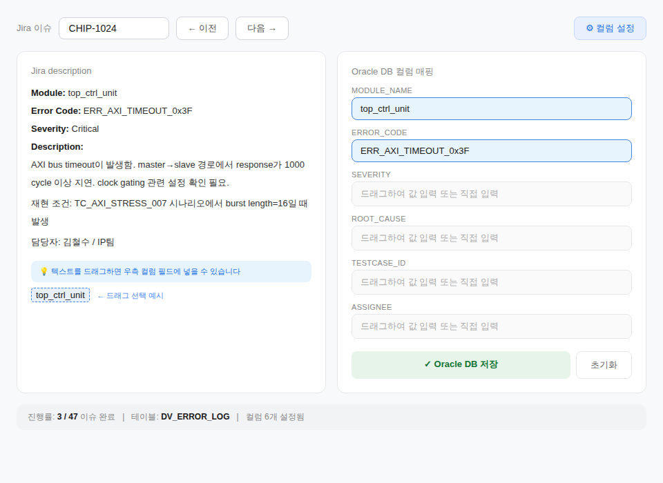
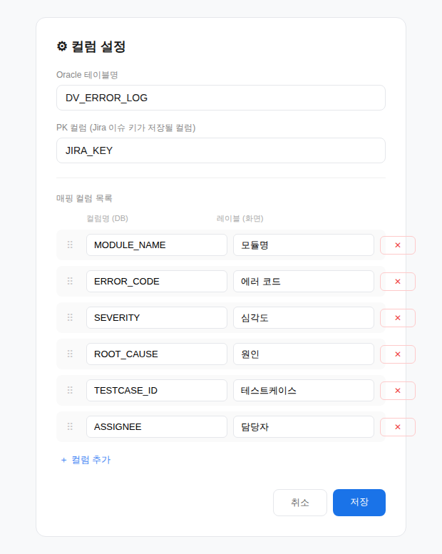

# Jira-to-Oracle Mapping Tool — MVP 개발 문서

> v1.0 | 2026-03-17

---

## 1. 개요

### 1.1 목적

Jira 이슈의 description 필드에 무정형으로 작성된 데이터를 사람이 직접 확인하며, Oracle DB의 특정 컬럼에 빠르게 매핑하여 저장하는 경량 웹 애플리케이션.

### 1.2 핵심 컨셉

- 좌측: Jira description 원문 표시 (텍스트 드래그 선택 가능)
- 우측: Oracle DB 컬럼 필드 (드래그한 텍스트를 클릭으로 드롭 또는 직접 입력)
- 컬럼 목록을 동적으로 추가/삭제/순서 변경 가능
- 값이 입력된 컬럼만 UPDATE — 빈 필드는 쿼리에서 제외 (기존 DB 값 보존)

### 1.3 기술 스택

| 구분 | 기술 |
|------|------|
| Backend | Python 3.10+ / FastAPI |
| Frontend | Vue 3 (Composition API) + Vite |
| DB 접속 | `python-oracledb` (thick mode, TNS) |
| Jira 접속 | Jira REST API v2 (`requests`) |
| 설정 저장 | JSON 파일 (컬럼 정의, 테이블명 등) |

---

## 2. 화면 구성

### 2.1 메인 화면 — 매핑 작업

2컬럼 레이아웃으로 구성한다.



#### A. 좌측 패널: Jira Description 뷰어

- Jira 이슈 키 입력란 + 불러오기 버튼
- description 원문 표시 영역 (읽기 전용, 드래그 선택 가능)
- 텍스트 드래그 시 선택된 문자열이 하이라이트 표시
- Jira의 다른 필드(summary, priority, assignee 등)도 참고용으로 표시
- 이전/다음 버튼으로 이슈 네비게이션 (배치 모드)

#### B. 우측 패널: 컬럼 매핑 필드

- 설정된 컬럼 목록이 입력 필드로 동적 렌더링
- 각 필드는 드래그 드롭 대상 또는 직접 타이핑 가능
- 필드 우측에 개별 초기화(×) 버튼
- **Oracle DB 저장** 버튼: 값이 있는 필드만 UPDATE
- **전체 초기화** 버튼: 모든 필드 비움

#### C. 하단 상태바

- 진행률 표시: `3 / 47 이슈 완료`
- 현재 대상 테이블명, 설정된 컬럼 수 표시

### 2.2 설정 화면 — 컬럼 관리

모달 또는 별도 페이지로 구성한다.



- Oracle 테이블명 입력
- PK 컬럼 지정 (Jira 이슈 키가 들어갈 컬럼)
- 매핑 컬럼 추가: 컬럼명(DB) + 레이블(화면 표시명)
- 컬럼 순서 변경 (드래그 정렬)
- 컬럼 삭제
- 설정은 JSON 파일로 저장/로드

---

## 3. API 설계

### 3.1 Backend API 엔드포인트

| Method | Endpoint | 설명 |
|--------|----------|------|
| GET | `/api/config` | 컬럼 설정 조회 (테이블명, PK, 컬럼 목록) |
| PUT | `/api/config` | 컬럼 설정 저장 |
| GET | `/api/jira/{issueKey}` | Jira 이슈 조회 (description + 기타 필드) |
| GET | `/api/jira/list` | Jira 이슈 목록 조회 (JQL 기반) |
| POST | `/api/save` | Oracle DB 저장 (값이 있는 컬럼만 UPDATE) |

### 3.2 주요 API 상세

#### GET /api/jira/{issueKey}

Jira REST API를 호출하여 이슈 정보를 반환한다.

**Response:**

```json
{
  "key": "CHIP-1024",
  "summary": "AXI bus timeout in top_ctrl_unit",
  "description": "Module: top_ctrl_unit\nError Code: ...",
  "priority": "Critical",
  "assignee": "김철수",
  "status": "Open"
}
```

#### POST /api/save

**핵심 로직:** 값이 있는 필드만 UPDATE 쿼리에 포함한다. 빈 필드는 쿼리에서 완전히 제외하여 기존 DB 값을 보존한다.

**Request:**

```json
{
  "issue_key": "CHIP-1024",
  "mappings": {
    "MODULE_NAME": "top_ctrl_unit",
    "ERROR_CODE": "ERR_AXI_TIMEOUT_0x3F",
    "SEVERITY": "Critical"
  }
}
```

**생성되는 SQL (예시):**

```sql
-- Row가 존재할 때 (UPDATE)
UPDATE DV_ERROR_LOG
SET MODULE_NAME = :MODULE_NAME,
    ERROR_CODE = :ERROR_CODE,
    SEVERITY = :SEVERITY
WHERE JIRA_KEY = :issue_key

-- Row가 없을 때 (INSERT)
INSERT INTO DV_ERROR_LOG (JIRA_KEY, MODULE_NAME, ERROR_CODE, SEVERITY)
VALUES (:issue_key, :MODULE_NAME, :ERROR_CODE, :SEVERITY)
```

> ⚠️ **주의:** `mappings`에 포함되지 않은 컬럼은 SET 절에 절대 포함하지 않는다.

#### PUT /api/config

**Request:**

```json
{
  "table_name": "DV_ERROR_LOG",
  "pk_column": "JIRA_KEY",
  "columns": [
    {"name": "MODULE_NAME", "label": "모듈명", "order": 1},
    {"name": "ERROR_CODE", "label": "에러 코드", "order": 2},
    {"name": "SEVERITY", "label": "심각도", "order": 3},
    {"name": "ROOT_CAUSE", "label": "원인", "order": 4},
    {"name": "TESTCASE_ID", "label": "테스트케이스", "order": 5},
    {"name": "ASSIGNEE", "label": "담당자", "order": 6}
  ]
}
```

---

## 4. 핵심 로직 상세

### 4.1 텍스트 드래그 → 컬럼 매핑 흐름

1. 사용자가 좌측 description에서 텍스트를 드래그하여 선택
2. 선택된 텍스트가 하이라이트 표시됨
3. 우측 컬럼 필드를 클릭하면 선택된 텍스트가 해당 필드에 입력됨
4. 또는 필드에 직접 타이핑으로 값 입력 가능
5. 필드 우측 × 버튼으로 개별 필드 초기화

### 4.2 DB 저장 로직 (Backend)

**저장 버튼 클릭 시 동작:**

1. Request의 `mappings`에서 값이 빈 문자열("") 또는 null인 항목 제거
2. 남은 컬럼이 0개면 저장 거부 (에러 반환)
3. PK(JIRA_KEY) 기준으로 SELECT하여 row 존재 여부 확인
4. Row 존재 → 값이 있는 컬럼만 SET 절에 포함하여 UPDATE
5. Row 부재 → PK + 값이 있는 컬럼만으로 INSERT

> ⚠️ **절대 규칙:** mappings에 포함되지 않은 컬럼은 UPDATE SET 절에 넣지 않는다. 이로써 기존 DB에 저장된 값이 NULL로 덮어씌워지는 것을 방지한다.

### 4.3 컬럼 설정 저장 구조

설정은 `config.json` 파일로 관리한다:

```json
{
  "table_name": "DV_ERROR_LOG",
  "pk_column": "JIRA_KEY",
  "jira_base_url": "https://jira.company.com",
  "jira_jql": "project = CHIP AND status = Open",
  "columns": [
    {"name": "MODULE_NAME", "label": "모듈명", "order": 1},
    {"name": "ERROR_CODE", "label": "에러 코드", "order": 2},
    ...
  ]
}
```

---

## 5. 프론트엔드 상세

### 5.1 드래그 선택 구현

좌측 description 영역에서 텍스트를 드래그하면:

- `mouseup` 이벤트에서 `window.getSelection().toString()`으로 선택 텍스트 추출
- 선택된 텍스트를 상태(`selectedText`)에 저장
- 우측 컬럼 필드 클릭 시 `selectedText` 값을 해당 필드에 입력
- 입력 후 `selectedText` 초기화

### 5.2 컬럼 필드 동적 렌더링

`config.columns` 배열을 `v-for`로 순회하며 필드를 동적 생성한다.

- 각 필드는 label 표시 + input + 초기화(×) 버튼으로 구성
- 값이 있는 필드는 파란색 바더로 시각적 구분
- 필드 클릭 시 현재 `selectedText`가 있으면 자동 입력, 없으면 직접 타이핑 모드

### 5.3 배치 모드

JQL로 가져온 이슈 목록을 순회하며 작업한다:

- 이전/다음 버튼 또는 키보드 단축키 (← / →)
- 저장 완료된 이슈는 목록에서 체크 표시
- 하단 상태바에 진행률 표시

---

## 6. 프로젝트 구조

```
jira-oracle-mapper/
├── backend/
│   ├── main.py              # FastAPI 앱 진입점
│   ├── config.py            # config.json 로드/저장
│   ├── jira_client.py       # Jira REST API 호출
│   ├── db.py                # Oracle DB 접속 및 동적 쿼리
│   ├── schemas.py           # Pydantic 모델
│   └── config.json          # 컬럼 설정 파일
├── frontend/
│   ├── src/
│   │   ├── App.vue
│   │   ├── views/
│   │   │   ├── MappingView.vue  # 메인 매핑 화면
│   │   │   └── ConfigView.vue   # 컬럼 설정 화면
│   │   ├── components/
│   │   │   ├── DescriptionPanel.vue
│   │   │   ├── ColumnFields.vue
│   │   │   └── StatusBar.vue
│   │   └── composables/
│   │       └── useTextSelection.js
│   ├── package.json
│   └── vite.config.js
└── README.md
```

---

## 7. 환경 설정

### 7.1 Backend

```bash
# 의존성
pip install fastapi uvicorn python-oracledb requests pydantic

# 환경 변수 (.env)
ORACLE_DSN=host:1521/service_name
ORACLE_USER=username
ORACLE_PASSWORD=password
ORACLE_CLIENT_DIR=/path/to/instantclient  # thick mode
JIRA_BASE_URL=https://jira.company.com
JIRA_TOKEN=your_api_token
```

### 7.2 Frontend

```bash
cd frontend
npm install
npm run dev

# vite.config.js에서 proxy 설정
# /api → http://localhost:8000 (FastAPI)
```

### 7.3 Oracle DB (사전 준비)

대상 테이블이 이미 존재해야 한다. 앱이 테이블을 생성하지는 않는다.

---

## 8. 구현 우선순위

| 순서 | 작업 | 예상 소요 | 의존성 |
|------|------|-----------|--------|
| 1 | 컬럼 설정 화면 + JSON 저장/로드 | 2시간 | 없음 |
| 2 | Jira 이슈 조회 API + 좌측 패널 표시 | 2시간 | 없음 |
| 3 | 텍스트 드래그 → 컬럼 필드 매핑 인터랙션 | 3시간 | 1, 2 |
| 4 | Oracle DB 저장 (동적 UPDATE/INSERT) | 2시간 | 1, 3 |
| 5 | 배치 모드 (JQL 목록 + 네비게이션 + 진행률) | 2시간 | 2, 4 |

**총 예상 MVP 개발 소요: 약 11시간**

---

## 9. 주의사항 및 제약

- Oracle DB 테이블은 사전에 존재해야 함 (앱이 DDL 실행하지 않음)
- 컬럼명(`name`)은 실제 Oracle 테이블의 컬럼명과 정확히 일치해야 함
- Jira API 토큰 및 Oracle 접속 정보는 `.env`로 관리 (코드에 하드코딩 금지)
- SQL Injection 방지: 반드시 bind variable (`:param`) 사용
- 폐쇄망 환경 고려: 외부 CDN 없이 동작하도록 npm build 후 static 배포
- 동시 사용자 고려 없음 (MVP는 단일 사용자 기준)
