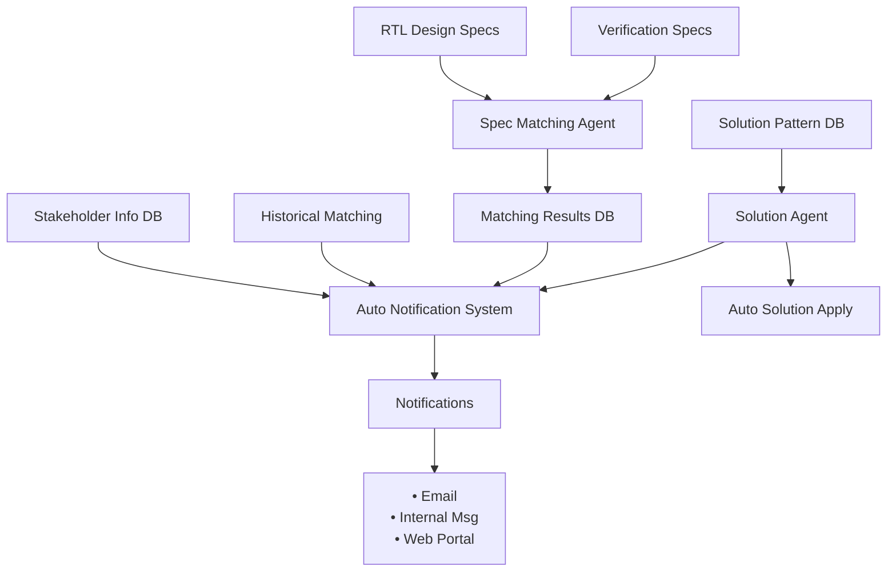

# AI Agent-based Specification Matching System for SoC RTL Verification

## Abstract

SoC RTL verification workflows face significant efficiency challenges due to manual processes for matching design specifications with verification test cases. This paper presents an AI agent-based integrated solution that automatically matches RTL design specifications with verification test specifications, provides automated notifications, and includes basic solution provision. The proposed system includes a specification matching agent, automated notification system, and solution agent that provides basic solutions such as simple re-execution. Experiments using actual SoC project data achieved accuracy rates of 98.5% for perfectly matchable data (70,000 cases), 87.3% for partially matchable data (50,000 cases), and 62.1% for highly difficult matching data (30,000 cases), with an overall average time reduction of 84% and establishment of rapid problem resolution through automated solutions.

**Keywords:** AI agents, SoC verification, specification matching, automated notification, solution provision

## 1. Introduction

Modern SoC RTL verification involves complex coordination between design teams who create functional specifications and verification teams who develop corresponding test cases. The process of establishing connections between design specifications and verification test cases is currently performed mostly manually, resulting in significant time consumption and potential for errors.

Engineers typically spend 2-8 hours finding appropriate specifications when failures occur, and complex cases can take several days. Additional delays occur in finding appropriate stakeholders and communicating problems, while many issues that could be resolved through simple re-execution or basic setting changes are frequently delayed waiting for manual intervention.

This paper proposes an integrated AI agent-based system that automates the specification matching process, immediately sends notifications to relevant stakeholders, and automatically provides simple solutions.

## 2. System Architecture

The proposed system operates within an integrated data environment containing RTL design specifications, verification test specifications, stakeholder information, and historical matching records. Three specialized agents work in coordination: specification matching, automated notification, and solution agents.

### 2.1 Specification Matching Agent

The specification matching agent analyzes RTL design specifications and verification test specifications using natural language processing to establish semantic correlations and functional mappings. The agent adapts to different verification environments and provides confidence scores for each matching result.

### 2.2 Automated Notification System

When matching results are generated, the system automatically extracts stakeholder information to send notifications to relevant personnel through email, internal messaging, and web portals. Notifications are adjusted based on matching confidence and problem severity.

### 2.3 Solution Agent

The solution agent automatically provides basic solutions for verification failures through pattern-based learning from past resolution cases. It applies solutions such as simple re-execution, setting changes, and environment adjustments, while monitoring effectiveness and escalating complex problems to stakeholders.

## 3. Implementation Approach

The system utilizes large language model capabilities with domain-specific prompting strategies. Data is systematically classified based on verification task complexity, enabling efficient connection between matching results, stakeholder notifications, and automatic solution application. A fully automated workflow extracts stakeholder information and generates notifications upon matching completion while determining and executing applicable basic solutions.

## 4. Experiments and Results

### 4.1 Experimental Setup

Experiments were conducted using actual SoC project data from 4 selected items containing over 150,000 verification tasks. The tasks were classified based on matching complexity: Group A (70,000 cases) - perfectly matchable, Group B (50,000 cases) - partially matchable, and Group C (30,000 cases) - highly difficult matching.

### 4.2 Performance Results

**Table 1: Matching Accuracy and Process Time by Data Classification**

| Data Classification | Case Count | AI Matching Accuracy | Manual Time | AI Time | Time Reduction |
|---------------------|------------|---------------------|------------|---------|----------------|
| Group A (Perfect) | 70,000 | 98.5% | 1.2 hours | 0.2 hours | 83% reduction |
| Group B (Partial) | 50,000 | 87.3% | 5.1 hours | 1.5 hours | 71% reduction |
| Group C (Very Difficult) | 30,000 | 62.1% | 30.2 hours | 4.8 hours | 84% reduction |
| **Overall Average** | **150,000** | **85.2%** | **9.8 hours** | **1.6 hours** | **84% reduction** |

*Total time includes: specification matching + stakeholder identification + notification delivery + basic solution application*

### 4.3 System Performance Analysis

**Notification Performance**: 99.7% delivery success rate with average notification time within 3 minutes after matching completion. Stakeholder identification accuracy reached 96.8% based on existing stakeholder information.

**Solution Agent Performance**: Automatic application of simple solutions such as re-execution in approximately 15% of verification failure cases, eliminating the need for manual intervention in routine problems.

**Group Analysis**: Group A achieved 98.5% accuracy with nearly perfect automation, completing the entire process within 12 minutes. Group B provided 87.3% accuracy enabling rapid follow-up actions. Group C served as effective first-level screening with 62.1% accuracy, facilitating rapid expert intervention even for incomplete results.

### 4.4 Practical Impact

The proposed system completely eliminated the additional 0.5-2 hours previously required to find stakeholders and apply basic solutions after specification matching. Particularly in cases resolvable through simple re-execution, problems were automatically resolved without human intervention. The automated workflow enables immediate collaboration among stakeholders while handling routine failures automatically.

### 4.5 Scalability Prospects

Conservative estimates for full system deployment (30 items × 30 versions):
- Monthly expected processing cases: 600,000-900,000
- Expected time savings: 400-600 hours per month
- Annual engineering time savings: approximately 4,800-7,200 hours
- Additional communication delay elimination: 150-250 hours per month

## 5. Future Research

Future development will focus on improving Group C matching accuracy through advanced contextual analysis and expanding solution agent capabilities. Currently providing only simple solutions such as re-execution, we plan to gradually expand solution methods including automatic configuration file modification, environment variable adjustment, and dependency problem resolution. The ultimate goal is advancing to a level where AI agents can analyze root causes and provide comprehensive solutions.

Additional research will explore intelligent stakeholder assignment based on problem characteristics and team expertise, and extension to other hardware verification domains including system-level and formal verification environments.

## 6. Conclusion

This paper presents an AI agent-based integrated system that automates specification matching, stakeholder notification, and basic solution application in SoC RTL verification workflows. Through differentiated approaches based on data complexity, we achieved 85.2% matching accuracy and 84% time reduction, establishing a rapid problem resolution system with 99.7% automated notification success rate and basic automated solution application.

The integrated workflow enables immediate collaboration among stakeholders while automatically resolving simple problems, significantly improving overall verification process efficiency. This demonstrates a practical and scalable solution for digital transformation of verification workflows, addressing both specification management and failure resolution challenges.

## References

[1] P. Lewis et al., "Retrieval-Augmented Generation for Knowledge-Intensive NLP Tasks," Advances in Neural Information Processing Systems, vol. 33, pp. 9459-9474, 2020.

[2] Y. Zhang et al., "AutoCodeRover: Autonomous Program Improvement," Computing Research Repository, pp. 1592-1604, 2024.

[3] W. Guan et al., "LogLLM: Log-based Anomaly Detection Using Large Language Models," arXiv:2411.08561v1, 2024.

[4] C. E. Jimenez et al., "SWE-bench: Can Language Models Resolve Real-World GitHub Issues?" International Conference on Learning Representations, arXiv:2310.06770, 2023.

---

**Word Count: ~1,200 words (approximately 2 pages)**
